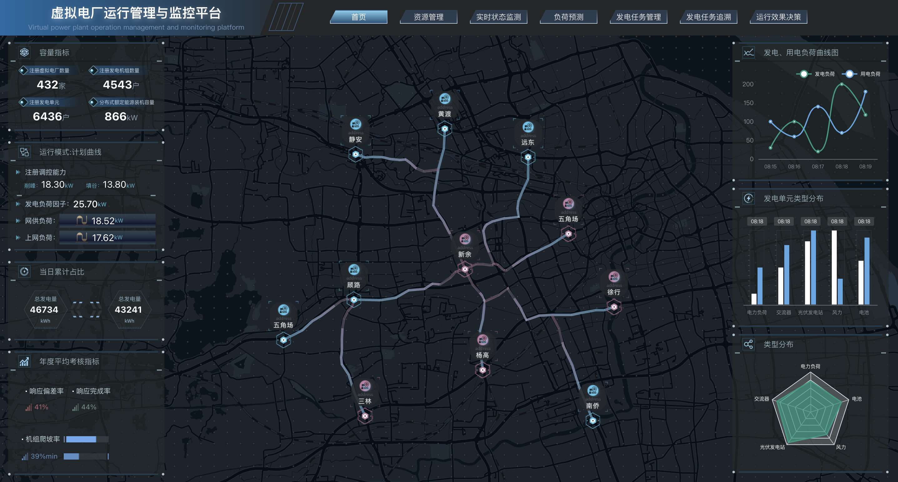

# 虚拟电厂功能展示平台 (VPP - Virtual Power Plant)

<div align="center">



[](https://vuejs.org/)
[](https://www.typescriptlang.org/)
[](https://vitejs.dev/)
[](https://element-plus.org/)
[](LICENSE)

**现代化的虚拟电厂管理与监控平台**

[在线演示](https://your-demo-url.com) · [功能特性](#功能特性) · [快速开始](#快速开始) · [API 文档](#api-文档)

</div>

## 📋 项目简介

虚拟电厂功能展示平台是一个基于 Vue 3 + TypeScript 构建的现代化 Web 应用，专为虚拟电厂的运营管理、数据监控和可视化展示而设计。平台集成了先进的地图可视化、实时数据图表和智能化的用户界面，为电力行业提供的数字化解决方案。

## ✨ 功能特性

### 🎯 核心功能
- **实时监控面板** - 电厂运行状态实时监控与告警
- **地图可视化** - 基于 L7 的高性能地理信息展示
- **数据分析** - ECharts 驱动的多维度数据图表
- **设备管理** - 电厂设备的全生命周期管理
- **报表系统** - 自动化报表生成与 PDF 导出

### 🛠 技术亮点
- **现代化架构** - Vue 3 Composition API + TypeScript
- **响应式设计** - 支持多设备自适应布局
- **组件化开发** - Element Plus + 自定义组件库
- **状态管理** - Pinia 轻量级状态管理
- **代码质量** - ESLint + Prettier + OxLint 多重代码检查
- **开发体验** - Vite 极速构建 + Vue DevTools

## 🚀 快速开始

### 环境要求

- **Node.js** >= 18.0.0
- **pnpm** >= 8.0.0 (推荐) 或 npm/yarn

### 安装依赖

```bash
# 使用 pnpm (推荐)
pnpm install

# 或使用 npm
npm install

# 或使用 yarn
yarn install
```

### 开发环境

```bash
# 启动开发服务器
pnpm serve

# 服务将运行在 http://localhost:3333
```

### 生产构建

```bash
# 类型检查 + 构建
pnpm build

# 仅构建 (跳过类型检查)
pnpm build-only

# 预览构建结果
pnpm preview
```

## 📁 项目结构

```
vpp/
├── docs/                   # 构建输出目录
├── public/                 # 静态资源
├── src/
│   ├── assets/            # 资源文件 (图片、样式、图标)
│   ├── components/        # 可复用组件
│   ├── router/           # 路由配置
│   ├── stores/           # Pinia 状态管理
│   ├── views/            # 页面组件
│   ├── App.vue           # 根组件
│   └── main.ts           # 应用入口
├── package.json          # 项目配置
├── vite.config.ts        # Vite 配置
└── tsconfig.json         # TypeScript 配置
```

## 🔧 开发指南

### 代码规范

项目使用多层代码质量检查：

```bash
# 运行所有代码检查
pnpm lint

# 仅运行 ESLint
pnpm lint:eslint

# 仅运行 OxLint
pnpm lint:oxlint

# 格式化代码
pnpm format
```

### 类型检查

```bash
# TypeScript 类型检查
pnpm type-check
```

### 组件开发

项目支持自动导入：
- Vue 组件自动注册
- Element Plus 组件按需导入
- API 函数自动导入

### 样式开发

- **UnoCSS** - 原子化 CSS 框架
- **SCSS** - CSS 预处理器
- **Element Plus** - UI 组件库主题定制

## 🌐 部署指南

### 静态部署

```bash
# 构建项目
pnpm build

# 部署 docs/ 目录到静态服务器
```

### Docker 部署

```dockerfile
FROM node:18-alpine as builder
WORKDIR /app
COPY package*.json ./
RUN npm ci --only=production

COPY . .
RUN npm run build

FROM nginx:alpine
COPY --from=builder /app/docs /usr/share/nginx/html
EXPOSE 80
CMD ["nginx", "-g", "daemon off;"]
```

### 环境变量

创建 `.env.local` 文件配置环境变量：

```env
# API 基础地址
VITE_API_BASE_URL=https://api.example.com

# 应用标题
VITE_APP_TITLE=虚拟电厂管理平台
```

## 📊 技术栈

### 前端框架
- **Vue 3** - 渐进式 JavaScript 框架
- **TypeScript** - 类型安全的 JavaScript 超集
- **Vite** - 下一代前端构建工具

### UI 组件
- **Element Plus** - Vue 3 组件库
- **UnoCSS** - 即时原子化 CSS 引擎

### 数据可视化
- **ECharts** - 强大的数据可视化库
- **AntV L7** - 地理空间数据可视化

### 开发工具
- **ESLint** - 代码质量检查
- **Prettier** - 代码格式化
- **OxLint** - 高性能 Rust 代码检查器

## 🤝 贡献指南

我们欢迎所有形式的贡献！

1. Fork 本仓库
2. 创建特性分支 (`git checkout -b feature/AmazingFeature`)
3. 提交更改 (`git commit -m 'Add some AmazingFeature'`)
4. 推送到分支 (`git push origin feature/AmazingFeature`)
5. 开启 Pull Request

### 提交规范

请遵循 [Conventional Commits](https://conventionalcommits.org/) 规范：

```
feat: 添加新功能
fix: 修复问题
docs: 文档更新
style: 代码格式调整
refactor: 代码重构
test: 测试相关
chore: 构建过程或辅助工具的变动
```

## 📄 许可证

本项目采用 [MIT 许可证](LICENSE)。

## 🙏 致谢

感谢以下开源项目的支持：
- [Vue.js](https://vuejs.org/) - 渐进式 JavaScript 框架
- [Element Plus](https://element-plus.org/) - Vue 3 组件库
- [ECharts](https://echarts.apache.org/) - 数据可视化
- [AntV L7](https://l7.antv.vision/) - 地理空间数据可视化

---

<div align="center">

**[⬆ 回到顶部](#虚拟电厂功能展示平台-vpp---virtual-power-plant)**

Made with ❤️ by VPP Team

</div>
